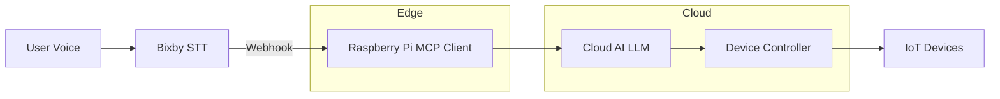

# 🤖 J.A.R.V.I.S

### AI-Powered Smart Home Control System

---

## 📌 Overview

**삼성 갤럭시 Bixby 기반 AI 스마트홈 제어 시스템**

사용자는 **Bixby**를 통해 자연어 음성 명령을 입력하며,
해당 명령은 **MCP(Model Context Protocol) 기반 Edge Client**와
**Cloud AI 환경**을 거쳐 실제 스마트홈 디바이스를 제어한다.

본 프로젝트는 **Edge + Cloud 하이브리드 구조**를 통해
저지연 제어와 확장성을 동시에 확보하는 것을 목표로 한다.

---

## 🔄 Command Flow

1. 사용자가 음성 명령 입력
2. Bixby에서 음성 → 텍스트(STT) 변환 및 Webhook 호출
3. **Raspberry Pi** 기반 MCP Client에서 Context 포함 명령 처리
4. Cloud AI에서 Intent 분석 및 Action 결정
5. Device Controller를 통해 실제 디바이스 제어
6. 처리 결과를 사용자에게 응답

---

## 🧱 System Architecture

---

## 🧠 MCP Client (Edge)

- 자연어 명령 수신 및 Context 관리
- 자주 사용하는 명령에 대한 로컬 Rule 처리 (저지연)
- Cloud API 중계 및 장애 완화
- MQTT / Zigbee 등 스마트홈 프로토콜 확장 가능

---

## ☁️ Cloud Components

- LLM 기반 Intent Parsing
- Rule / Scenario Engine
- Device Control API
- 사용자 및 디바이스 상태 관리

---

## 🔐 Security

- OAuth2 / mTLS 기반 인증
- Edge ↔ Cloud Zero Trust 통신
- 디바이스 단위 권한 제어

---
